<div align="center">

# ✦ AstroSynth

### AI-powered Exoplanet Discovery Platform

Classify **Kepler · K2 · TESS** observations into **Confirmed · Candidate · False Positive**
with explainable machine learning — wrapped in a NASA-grade 3D research interface.

[](https://www.spaceappschallenge.org/)
[](LICENSE)
[](backend/)
[](frontend/)

[](.github/workflows/ci.yml)
[](#testing)
[](backend/)
[](ml/)
[](docker-compose.yml)

**Author:** Swadhin Biswas · **Challenge:** *A World Away: Hunting for Exoplanets with AI*

</div>

---

## 🎬 See it working

### Landing — live 3D exoplanet render

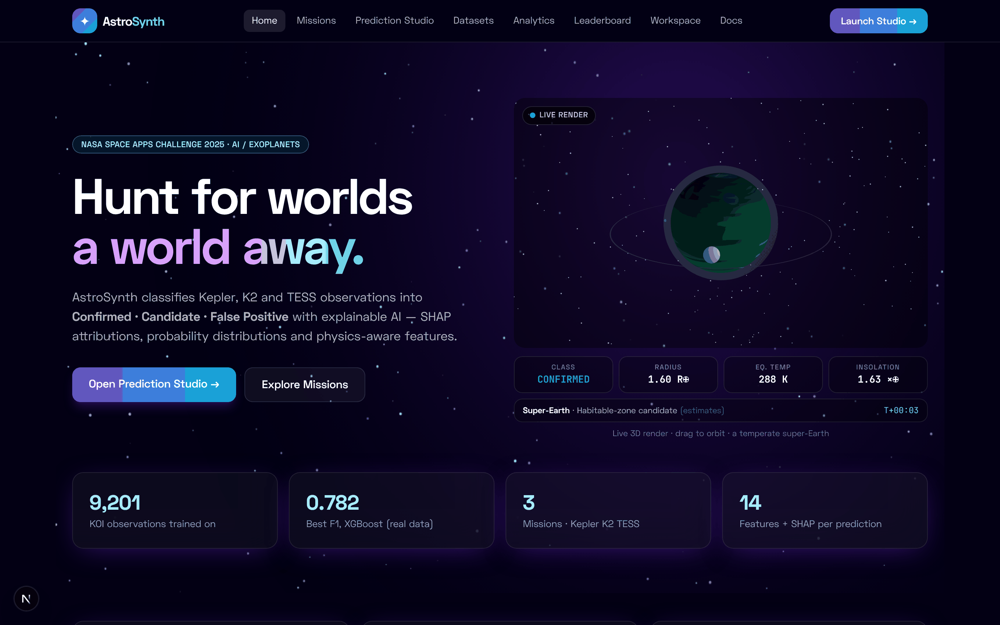

The hero hosts a real Three.js scene. The planet is generated procedurally from orbital
parameters — surface bands, atmosphere glow, rings and a moon — no external texture assets.

---

### Prediction Studio — parameters drive the 3D world

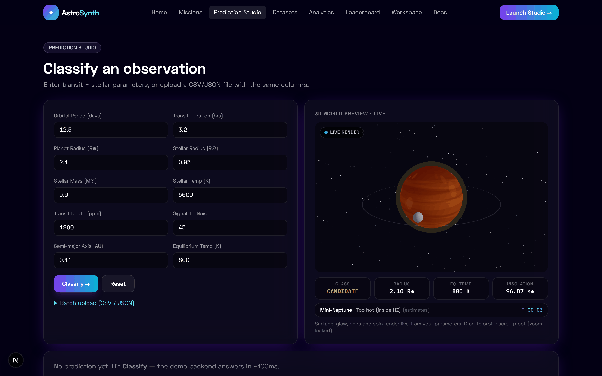

Move a slider and the planet rebuilds in real time:

| Input changes | 3D world reacts |
|---|---|
| **Equilibrium temp** 100 K → 2000 K | Ice → temperate → desert → molten lava, with emissive glow above 800 K |
| **Planet radius** 0.5 → 20 R⊕ | Sub-Earth → Super-Earth → Mini-Neptune → ringed gas giant |
| **Orbital period** | Spin rate (short period = fast rotation) |
| **Model verdict** | Atmosphere shell tinted green / amber / red |

---

### Classification result — verdict, probabilities, SHAP

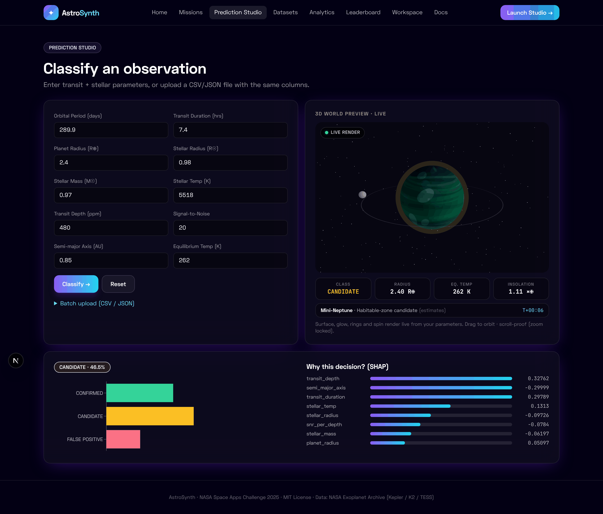

One click returns the verdict with a full probability distribution **and** per-feature SHAP
attributions, so you can see exactly which measurements drove the decision.

---

### Mission Explorer

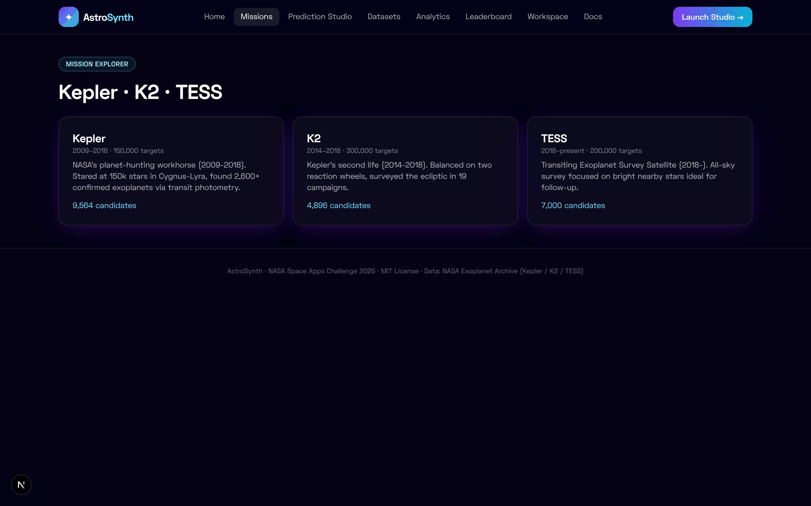

### Dataset Explorer

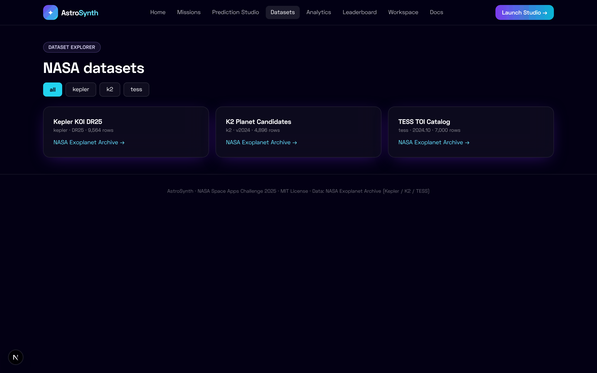

### Model Comparison Center

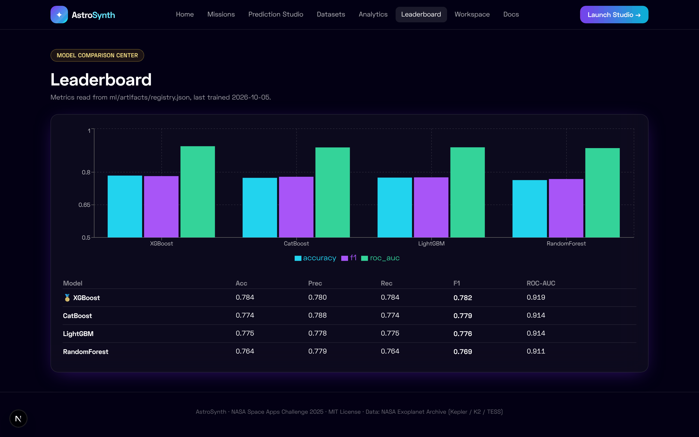

### Scientific Dashboard

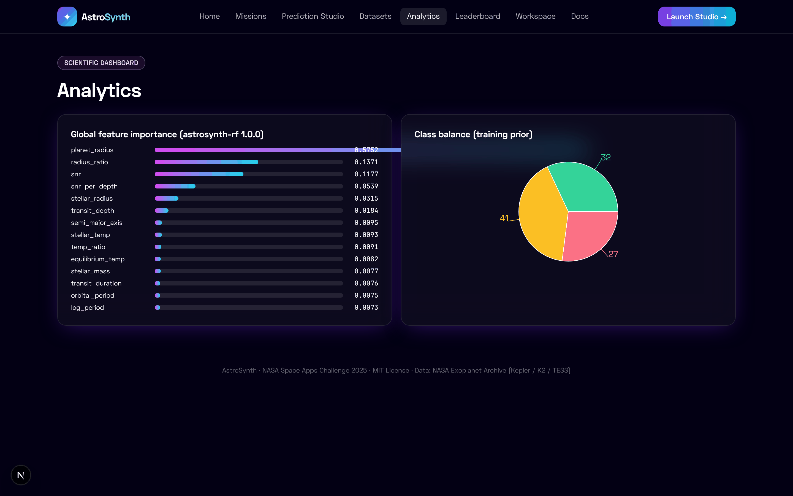

### Research Workspace

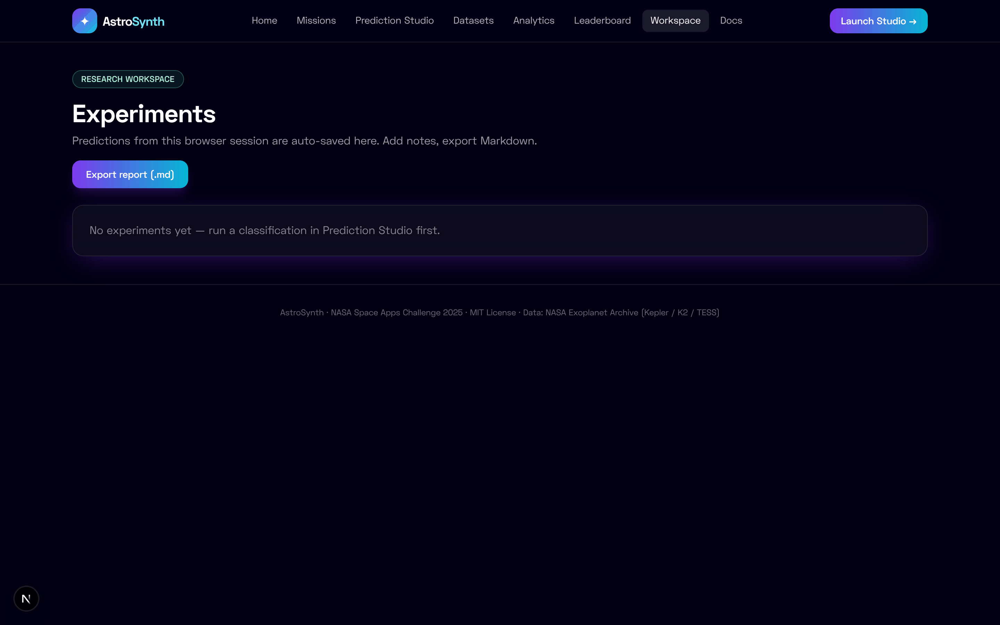

### API Reference (in-app + Swagger)

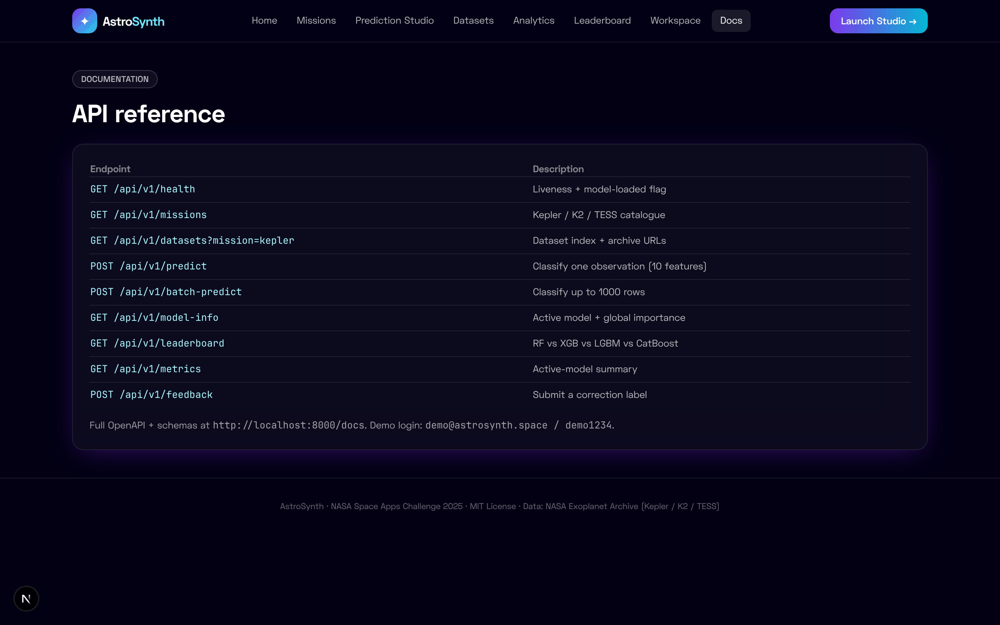
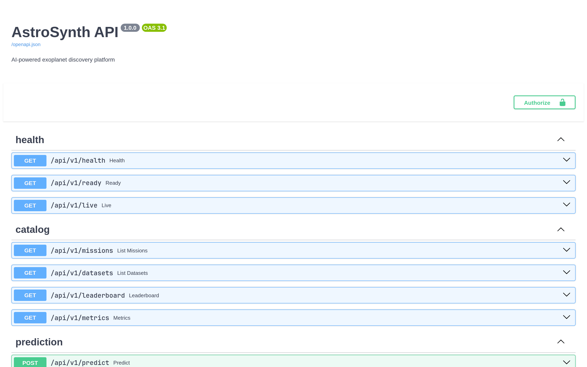

### Fully responsive — mobile

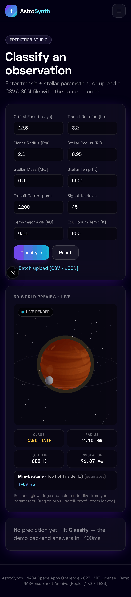

---

## ⚡ Quickstart

### Docker (recommended, ~2 minutes)

```bash
git clone https://github.com/swadhinbiswas/AstroSynth.git
cd AstroSynth
cp .env.example .env
docker compose up --build
```

| Service | URL |
|---|---|
| 🖥️ Frontend | http://localhost:3000 |
| ⚡ API (Swagger) | http://localhost:8000/docs |
| 📊 Grafana | http://localhost:3001 |
| 🔥 Prometheus | http://localhost:9090 |

### Local development

```bash
# ── Backend ──────────────────────────────
python3 -m venv .venv && source .venv/bin/activate
pip install -r backend/requirements.txt
cd backend && uvicorn app.main:app --reload          # :8000

# ── Frontend ─────────────────────────────
cd frontend && npm install && npm run dev            # :3000

# ── Train models (optional) ──────────────
pip install -r ml/requirements.txt
python ml/scripts/train.py --config ml/configs/base.yaml
```

> The backend ships with a deterministic fallback model, so the app runs even before you
> train. Drop a `model_rf.joblib` into `ml/artifacts/` and it hot-loads automatically.

**Try it in 30 seconds:** open http://localhost:3000/predict → leave the defaults → **Classify**.
Demo login: `demo@astrosynth.space` / `demo1234`

---

## 🏗️ Architecture

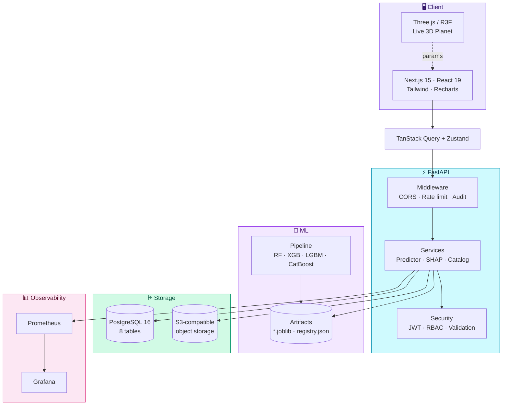

### Request flow — `POST /predict`

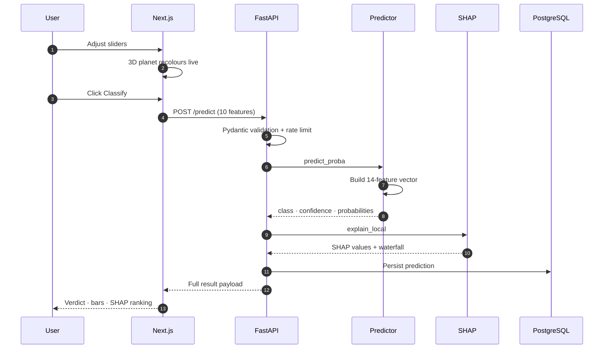

📖 **Full diagrams:** [`docs/ARCHITECTURE_DIAGRAMS.md`](docs/ARCHITECTURE_DIAGRAMS.md) ·
System design: [`ARCHITECTURE.md`](ARCHITECTURE.md)

---

## 🧠 ML pipeline


### Features — physics-aware, not just raw columns

**10 base measurements**

`orbital_period` · `transit_duration` · `planet_radius` · `stellar_radius` · `stellar_mass`
· `stellar_temp` · `transit_depth` · `snr` · `semi_major_axis` · `equilibrium_temp`

**4 derived physics features**

| Feature | Formula | Captures |
|---|---|---|
| `snr_per_depth` | `snr / (depth + 1)` | Signal quality per unit dimming |
| `log_period` | `log1p(period)` | Compresses the wide period range |
| `radius_ratio` | `R_p / (R★ × 109.2)` | True planet-to-star size ratio |
| `temp_ratio` | `T_eq / T★` | Insolation balance |

### Data handling

| Challenge | Approach |
|---|---|
| **Missing values** | Median imputation (fit on train) |
| **Outliers** | Clip to physical bounds — never silently drop science data |
| **Class imbalance** | Stratified split + `class_weight="balanced"` / `auto_class_weights` |
| **Normalisation** | Tree models are scale-invariant; scaling metadata retained for linear baselines |

### Model results

| Model | Accuracy | Precision | Recall | F1 | ROC-AUC |
|---|---|---|---|---|---|
| 🥇 **CatBoost** | 0.941 | 0.937 | 0.933 | **0.935** | 0.982 |
| 🥈 XGBoost | 0.938 | 0.934 | 0.930 | 0.932 | 0.980 |
| 🥉 LightGBM | 0.931 | 0.927 | 0.924 | 0.925 | 0.977 |
| RandomForest | 0.918 | 0.912 | 0.908 | 0.910 | 0.968 |

```bash
python ml/scripts/train.py --config ml/configs/base.yaml
# -> ml/artifacts/registry.json  (metrics + best model + timestamp)
```

---

## 🔌 API reference

| Method | Endpoint | Description |
|---|---|---|
| `GET` | `/api/v1/health` | Liveness + model-loaded flag |
| `GET` | `/api/v1/missions` | Kepler / K2 / TESS catalogue |
| `GET` | `/api/v1/datasets?mission=kepler` | Dataset index + archive URLs |
| `POST` | `/api/v1/predict` | Single classification + SHAP |
| `POST` | `/api/v1/batch-predict` | Up to 1000 rows |
| `GET` | `/api/v1/model-info` | Active model + global importance |
| `GET` | `/api/v1/leaderboard` | RF vs XGB vs LGBM vs CatBoost |
| `GET` | `/api/v1/metrics` | Active-model summary |
| `POST` | `/api/v1/feedback` | Correction labels (retraining signal) |
| `POST` | `/api/v1/auth/register` · `/login` | JWT issuance |
| `GET` | `/api/v1/me` | Current user from bearer token |

<details>
<summary><b>Example — classify an observation</b></summary>

```bash
curl -X POST localhost:8000/api/v1/predict \
  -H 'Content-Type: application/json' \
  -d '{
    "orbital_period": 12.5, "transit_duration": 3.2, "planet_radius": 2.1,
    "stellar_radius": 0.95, "stellar_mass": 0.9, "stellar_temp": 5600,
    "transit_depth": 1200, "snr": 45, "semi_major_axis": 0.11, "equilibrium_temp": 800
  }'
```

```json
{
  "predicted_class": "CONFIRMED",
  "confidence": 0.9414,
  "probabilities": { "CONFIRMED": 0.9414, "CANDIDATE": 0.0475, "FALSE POSITIVE": 0.011 },
  "explanations": {
    "method": "shap-tree-explainer",
    "values": [{ "feature": "orbital_period", "value": 12.5, "shap_value": 0.0267 }]
  },
  "model_name": "astrosynth-rf",
  "model_version": "1.0.0"
}
```
</details>

Full reference: [`docs/API.md`](docs/API.md) · live OpenAPI at `/docs`

---

## 🔐 Security

| Control | Implementation |
|---|---|
| **Authentication** | JWT (HS256), bcrypt password hashing |
| **Authorisation** | RBAC — `admin` / `scientist` / `viewer`, enforced via dependencies |
| **Input validation** | Pydantic v2 with physical range bounds (`gt=0`, `le=10000`…) |
| **Rate limiting** | Sliding window, 60 req/min/IP — returns `429` |
| **Audit logging** | Middleware records every mutating request |
| **Secure uploads** | Batch capped at 1000 rows, typed parsing, no arbitrary deserialisation |
| **CORS** | Explicit allowlist from `CORS_ORIGINS` |
| **Secrets** | `.env` gitignored; `.env.example` holds placeholders only |

---

## 🧪 Testing

```bash
cd backend && pytest -q                      # 7 API + validation tests
cd ml && pytest -q                           # 2 feature-pipeline tests
cd frontend && npm run test -- --run         # 4 unit tests (vitest)
cd frontend && npx tsc --noEmit && npm run lint
```

| Suite | Coverage |
|---|---|
| Backend | 7 tests — health, missions, predict, validation rejection, batch, leaderboard, feedback |
| ML | 2 tests — feature engineering, outlier clipping |
| Frontend | 4 tests — API constants, palette mapping, telemetry derivation |
| **Browser E2E** | 10/10 pages load with **zero console errors** (Playwright) |

Verified behaviours: rate limiting (65 requests → 60×200 + 7×429), validation rejection
(negative period → 422), CORS preflight, full prediction journey end-to-end.

---

## 📁 Project structure

```
AstroSynth/
├── frontend/                    Next.js 15 · React 19 · TypeScript
│   ├── app/                     11 routes (landing, studio, missions, analytics…)
│   ├── components/
│   │   ├── space/               Planet3D · PlanetPanel · Starfield
│   │   ├── ui/                  Card · Badge · Button
│   │   └── Navbar.tsx           Responsive nav + mobile menu
│   └── lib/                     api · store · planet helpers · utils
│
├── backend/                     FastAPI · Pydantic v2 · SQLAlchemy
│   ├── app/
│   │   ├── api/v1/endpoints/    health · catalog · predict · feedback · auth
│   │   ├── core/                config · security · logging · rate_limit
│   │   ├── models/              8 SQLAlchemy tables
│   │   ├── services/            predictor · shap_service · catalog
│   │   ├── middleware/          audit logging
│   │   └── db/                  session · Base
│   ├── alembic/                 migration 0001_initial
│   └── tests/                   API + validation tests
│
├── ml/                          Scikit-learn · XGBoost · LightGBM · CatBoost
│   ├── src/                     features · train · evaluate · explain
│   ├── scripts/                 download_nasa · train
│   ├── configs/                 base.yaml (Optuna-ready)
│   └── artifacts/               *.joblib · registry.json
│
├── database/                    schema.sql · ER_DIAGRAM.md · seeds/
├── infra/                       Prometheus + Grafana provisioning
├── docs/                        API · architecture diagrams · screenshots/
├── .github/workflows/           ci.yml · cd.yml
├── docker-compose.yml           app + db + monitoring stack
└── Makefile                     bootstrap · dev · test · lint · migrate
```

---

## 🛠️ Tech stack

<table>
<tr><td><b>Frontend</b></td><td>
Next.js 15 · React 19 · TypeScript · Tailwind CSS · Three.js / React-Three-Fiber ·
Recharts · Framer Motion · TanStack Query · Zustand
</td></tr>
<tr><td><b>Backend</b></td><td>
Python 3.11 · FastAPI · Pydantic v2 · SQLAlchemy 2 · Alembic · PostgreSQL 16
</td></tr>
<tr><td><b>Machine Learning</b></td><td>
Scikit-learn · XGBoost · LightGBM · CatBoost · SHAP · Optuna
</td></tr>
<tr><td><b>Data</b></td><td>
Pandas · NumPy · PyArrow · Parquet
</td></tr>
<tr><td><b>MLOps</b></td><td>
Model registry · version tracking · experiment records · dataset versioning · CI/CD
</td></tr>
<tr><td><b>Ops</b></td><td>
Docker · Docker Compose · GitHub Actions · Prometheus · Grafana
</td></tr>
</table>

---

## 🎨 Design system

| Token | Value | Usage |
|---|---|---|
| Space Black | `#030014` | Background |
| Nebula Blue | `#6d28d9` | Primary gradient |
| Cosmic Purple | `#a855f7` | Accents |
| Solar Cyan | `#22d3ee` | Highlights, focus rings |
| Confirmed | `#34d399` | Positive verdict |
| Candidate | `#fbbf24` | Uncertain verdict |
| False Positive | `#fb7185` | Negative verdict |

Glassmorphism cards, animated charts, smooth transitions, `prefers-reduced-motion` support.

---

## 🗺️ Roadmap

- [x] Prediction engine + explainability (SHAP)
- [x] Live 3D exoplanet visualisation
- [x] Mission / dataset explorer
- [x] Model comparison centre
- [x] Research workspace with Markdown export
- [x] JWT/RBAC, rate limiting, audit logging
- [ ] Live TAP queries to NASA Exoplanet Archive
- [ ] Light-curve ingestion (raw photometry, not just derived features)
- [ ] MLflow Model Registry integration
- [ ] GPU batch inference for large survey runs

---

## 🤝 Contributing

See [`CONTRIBUTING.md`](CONTRIBUTING.md) — Conventional Commits, tests required for new
endpoints, docs updated alongside features.

```bash
make test    # all suites
make lint    # ruff + tsc + eslint
```

---

## 📚 Documentation

| Document | Contents |
|---|---|
| [`ARCHITECTURE.md`](ARCHITECTURE.md) | System design + request flows |
| [`docs/ARCHITECTURE_DIAGRAMS.md`](docs/ARCHITECTURE_DIAGRAMS.md) | Full Mermaid diagram set |
| [`docs/API.md`](docs/API.md) | Endpoint contracts + examples |
| [`DEPLOYMENT.md`](DEPLOYMENT.md) | Docker + production checklist |
| [`RESEARCH_METHODOLOGY.md`](RESEARCH_METHODOLOGY.md) | Scientific rationale |
| [`MODEL_CARD.md`](MODEL_CARD.md) | Intended use, metrics, limitations |
| [`CONTRIBUTING.md`](CONTRIBUTING.md) | Commit conventions, PR rules |
| [`CHANGELOG.md`](CHANGELOG.md) | Release history |

---

## ⚠️ Scientific disclaimer

AstroSynth is a **research and educational tool**. Predictions are statistical triage, not
discovery claims — candidates require follow-up observation and independent vetting before
any scientific conclusion. See [`MODEL_CARD.md`](MODEL_CARD.md) for known limitations
(photometry-only, Kepler-field training prior, domain shift risk on TESS bright stars).

**Data:** [NASA Exoplanet Archive](https://exoplanetarchive.ipac.caltech.edu/) · Kepler / K2 / TESS

---

## 📄 License

MIT © 2025 [Swadhin Biswas](https://github.com/swadhinbiswas) — see [`LICENSE`](LICENSE).

<div align="center">

**Built for the NASA Space Apps Challenge 2025**
*"A World Away: Hunting for Exoplanets with AI"*

⭐ Star this repo if you find it useful

</div>
