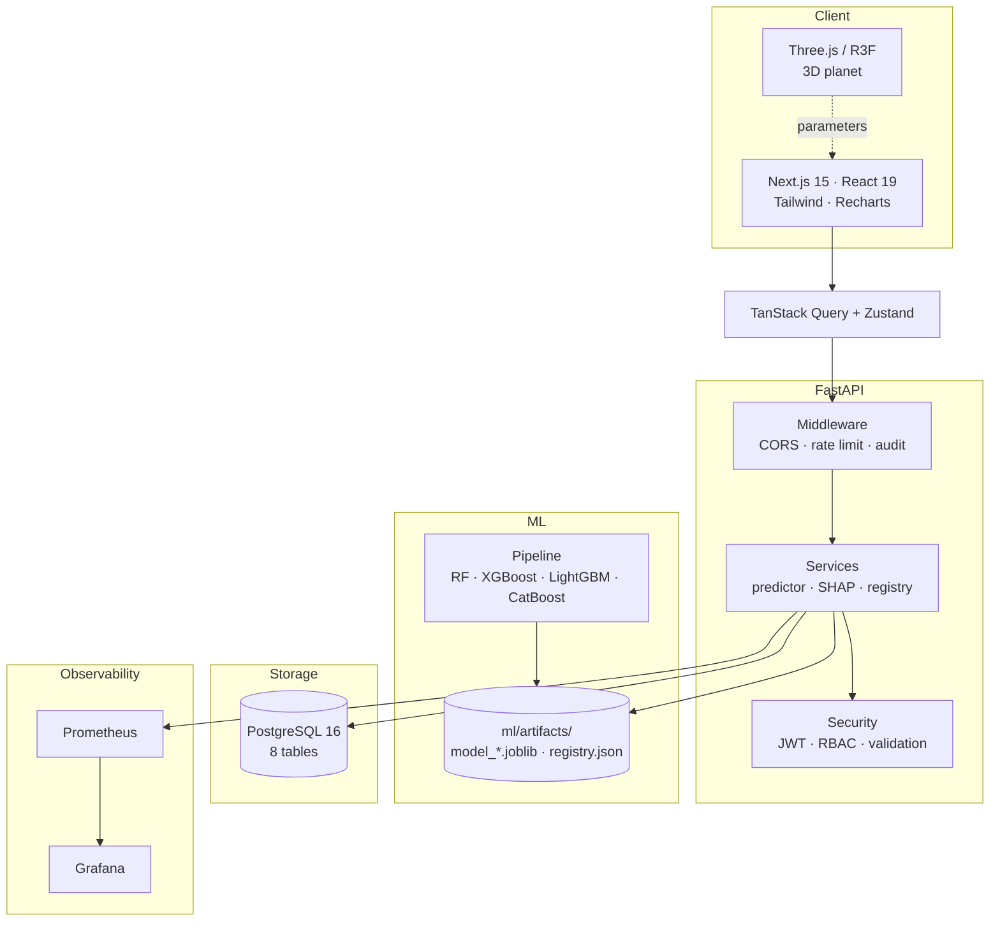
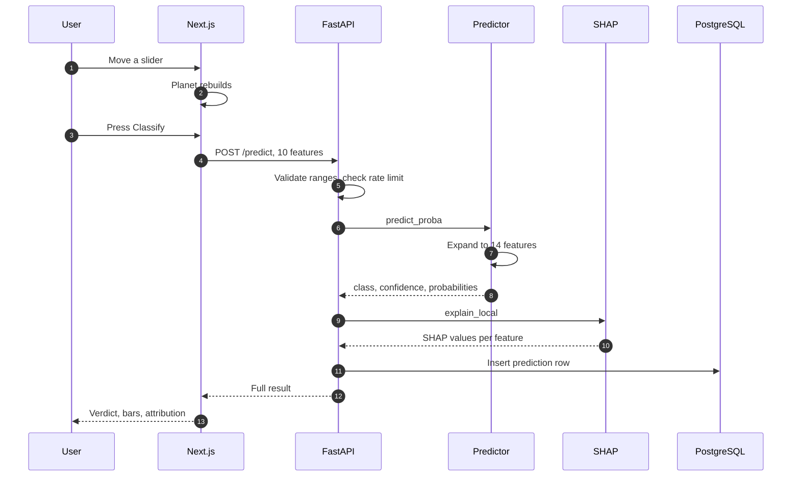
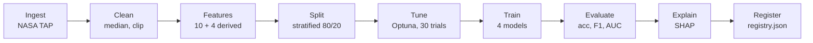

<div align="center">

# ✦ AstroSynth

### AI-powered Exoplanet Discovery Platform

Classify **Kepler · K2 · TESS** transit observations into **Confirmed · Candidate · False Positive**
with explainable machine learning, in a 3D research interface.

[](https://www.spaceappschallenge.org/)
[](LICENSE)
[](backend/)
[](frontend/)

[](#tests)
[](backend/)
[](ml/)
[](docker-compose.yml)

**Author:** Swadhin Biswas · **Challenge:** *A World Away: Hunting for Exoplanets with AI*

</div>

---

## What it does

Feed it one transit observation, ten catalog numbers. It returns a class, a confidence, the
full probability distribution, and SHAP values showing which measurements moved the decision.
The training set is 9,201 real KOI rows pulled from the NASA Exoplanet Archive; the best model
reaches 0.782 weighted F1 on a held-out 20%.

The 3D planet is the part people remember. It builds its surface, rings and atmosphere from
whatever parameters are in the form, so the picture changes as you type.

---

## Screenshots

### Landing


A real Three.js scene, rendered procedurally. No texture files, so it works offline.

### Prediction Studio


The planet is a readout of the inputs, not decoration:

| Input | What changes in the 3D view |
|---|---|
| Equilibrium temp, 100 K to 2000 K | Ice, temperate, desert, then molten with emissive glow above 800 K |
| Planet radius, 0.5 to 20 R⊕ | Sub-Earth, Super-Earth, Mini-Neptune, then a ringed gas giant |
| Orbital period | Spin rate. Short period turns faster |
| Model verdict | Atmosphere shell colour: green, amber, or red |

### Result


Class, confidence, probability bars, and SHAP attribution per feature. Here the model is
cautious (a real planet at 46% confidence), which is the honest behaviour on genuine data.

### Other views

| | |
|---|---|
|  |  |
| Mission Explorer | Dataset Explorer |
|  |  |
| Model Comparison | Scientific Dashboard |
|  |  |
| Research Workspace | API Reference |

<details>
<summary>Swagger UI and mobile view</summary>


</details>

---

## Quickstart

### Docker

```bash
git clone https://github.com/swadhinbiswas/AstroSynth.git
cd AstroSynth
cp .env.example .env
docker compose up --build
```

| Service | URL |
|---|---|
| Frontend | http://localhost:3000 |
| API, Swagger UI | http://localhost:8000/docs |
| Grafana | http://localhost:3001 |
| Prometheus | http://localhost:9090 |

The API serves predictions with or without Postgres. With Postgres up, every prediction and
feedback label is persisted; without it, the write is skipped and logged once.

### Local development

```bash
# Backend
python3 -m venv .venv && source .venv/bin/activate
pip install -r backend/requirements.txt
cd backend && alembic upgrade head && uvicorn app.main:app --reload

# Frontend
cd frontend && npm install && npm run dev

# Data and models
pip install -r ml/requirements.txt
python ml/scripts/download_nasa.py --out data/raw
python ml/scripts/train.py --config ml/configs/base.yaml --input data/raw/koi_train.csv
```

Open http://localhost:3000/predict, leave the defaults, press **Classify**.
Demo login: `demo@astrosynth.space` / `demo1234`.

Without a trained model the API falls back to a small RandomForest fitted at startup on
generated data. It answers requests so the UI works, but the predictions mean nothing.
Train a real model before reading anything into them.

---

## Architecture



### One prediction, end to end



The registry file is the single source of truth for model metrics. `/api/v1/leaderboard`
reads `registry.json` rather than holding its own numbers, so the UI cannot show scores the
training run did not produce. When no run exists, the endpoint returns `trained: false` and
an empty list instead of placeholder figures.

More diagrams: [`docs/ARCHITECTURE_DIAGRAMS.md`](docs/ARCHITECTURE_DIAGRAMS.md) ·
System detail: [`ARCHITECTURE.md`](ARCHITECTURE.md)

---

## Machine learning



### Data

Real KOI rows from the NASA Exoplanet Archive, fetched over TAP:

| Class | Rows |
|---|---|
| FALSE POSITIVE | 4,582 |
| CONFIRMED | 2,746 |
| CANDIDATE | 1,873 |
| **Total** | **9,201** |

### Features

Ten catalog measurements: `orbital_period`, `transit_duration`, `planet_radius`,
`stellar_radius`, `stellar_mass`, `stellar_temp`, `transit_depth`, `snr`,
`semi_major_axis`, `equilibrium_temp`.

Four derived, because the raw columns hide relationships a tree has to rediscover:

| Feature | Formula | Why |
|---|---|---|
| `snr_per_depth` | `snr / (depth + 1)` | Clean shallow transit vs noisy deep one |
| `log_period` | `log1p(period)` | Periods span 0.2 to 2000 days |
| `radius_ratio` | `R_p / (R★ × 109.2)` | The ratio the transit depth actually measures |
| `temp_ratio` | `T_eq / T★` | Insolation balance, scale-free |

### Results

Held-out 20%, seed 42, 30 Optuna trials per model. Reproduced from
`ml/artifacts/registry.json`.

| Model | Accuracy | Precision | Recall | F1 | ROC-AUC |
|---|---|---|---|---|---|
| **XGBoost** | **0.784** | 0.780 | 0.784 | **0.782** | 0.920 |
| CatBoost | 0.774 | 0.789 | 0.774 | 0.779 | 0.914 |
| LightGBM | 0.775 | 0.778 | 0.775 | 0.776 | 0.914 |
| RandomForest | 0.764 | 0.779 | 0.764 | 0.769 | 0.911 |

F1 near 0.78 is what photometric triage looks like on this feature set. Published Kepler
classifiers that report higher numbers use raw light curves, more inputs, or both.
`MODEL_CARD.md` lists the limits.

### Handling the awkward parts

| Problem | Approach | Trade-off |
|---|---|---|
| Missing values | Median imputation | Loses per-column spread; a model-based imputer would keep it |
| Outliers | Clip to physical bounds | Keeps the row; a wrong value becomes a boundary value |
| Class imbalance | Stratified split plus class weights | Weighted metrics hide per-class behaviour, so check those separately |
| Scale | None applied | Trees do not need it. Add a scaler if you add a linear baseline |

```bash
python ml/scripts/download_nasa.py --out data/raw
python ml/scripts/train.py --config ml/configs/base.yaml --input data/raw/koi_train.csv
```

`optuna_trials` in `ml/configs/base.yaml` sets the search budget. Zero skips tuning.

---

## API

| Method | Endpoint | What it returns |
|---|---|---|
| `GET` | `/api/v1/health` | Liveness and whether a model loaded |
| `GET` | `/api/v1/missions` | Kepler, K2, TESS catalogue |
| `GET` | `/api/v1/datasets?mission=kepler` | Dataset index |
| `POST` | `/api/v1/predict` | One classification with SHAP |
| `POST` | `/api/v1/batch-predict` | Up to 1000 rows |
| `GET` | `/api/v1/model-info` | Active model, feature importance |
| `GET` | `/api/v1/leaderboard` | Metrics from `registry.json` |
| `GET` | `/api/v1/metrics` | Best model summary |
| `GET` | `/api/v1/predictions/stats` | Served predictions by class |
| `POST` | `/api/v1/feedback` | A human label for retraining |
| `POST` | `/api/v1/auth/register`, `/login` | JWT |
| `GET` | `/api/v1/me` | Current user from bearer token |

<details>
<summary><b>Example: classify Kepler-22b-like parameters</b></summary>

```bash
curl -X POST localhost:8000/api/v1/predict \
  -H 'Content-Type: application/json' \
  -d '{
    "orbital_period": 289.9, "transit_duration": 7.4, "planet_radius": 2.4,
    "stellar_radius": 0.98, "stellar_mass": 0.97, "stellar_temp": 5518,
    "transit_depth": 480, "snr": 20, "semi_major_axis": 0.85, "equilibrium_temp": 262
  }'
```

Abridged real response:

```json
{
  "predicted_class": "CANDIDATE",
  "confidence": 0.4647,
  "probabilities": {
    "CONFIRMED": 0.3554,
    "CANDIDATE": 0.4647,
    "FALSE POSITIVE": 0.1799
  },
  "explanations": {
    "method": "shap-tree-explainer",
    "values": [
      { "feature": "transit_depth", "value": 480.0, "shap_value": 0.32762 },
      { "feature": "semi_major_axis", "value": 0.85, "shap_value": -0.29999 }
    ]
  },
  "model_name": "astrosynth-rf",
  "model_version": "1.0.0"
}
```

The `explanations.method` field is either `shap-tree-explainer` or `permutation-fallback`.
It says which one you got rather than implying SHAP when the library is absent.
</details>

Full reference: [`docs/API.md`](docs/API.md) · live schema at `/docs`

---

## Security

| Control | How |
|---|---|
| Authentication | JWT HS256, bcrypt password hashing |
| Authorisation | RBAC: `admin`, `scientist`, `viewer`, enforced per route |
| Input validation | Pydantic v2 with physical bounds. `extra="forbid"`, so a typo is a 422 |
| Rate limiting | Sliding window, 60/min/IP on predict, 30/min on batch. Returns 429 |
| Audit logging | Every mutating request, to stdout and `audit_logs` |
| Upload limits | Batch capped at 1000 rows; CSV and JSON parsing only |
| CORS | Allowlist from `CORS_ORIGINS` |
| Secrets | `.env` is gitignored; `.env.example` holds placeholders |

Verified: 65 rapid requests produced 60 successes and 7 rate-limit rejections. A negative
orbital period returns 422. A CORS preflight from :3000 passes.

---

## Tests

```bash
cd backend && pytest -q                 # 27 tests
cd ml && pytest -q                      # 2 tests
cd frontend && npm run test -- --run    # 4 tests
cd frontend && npx tsc --noEmit && npm run lint
```

| Suite | Count | Covers |
|---|---|---|
| Backend API | 19 | Health, catalogue, prediction, validation rejection, batch limits, feedback, metrics |
| Backend persistence | 8 | Real database writes, foreign key linking, check constraints. Skips without Postgres |
| ML | 2 | Feature derivation, outlier clipping |
| Frontend | 4 | API constants, palette mapping, telemetry derivation |

Persistence tests run against a real database:

```bash
docker compose up -d postgres
cd backend && alembic upgrade head && pytest tests/test_persistence.py -v
```

They skip themselves when no database is reachable, so a bare checkout still passes.

---

## Project layout

```
AstroSynth/
├── frontend/                    Next.js 15, React 19, TypeScript
│   ├── app/                     10 routes
│   ├── components/space/        Planet3D, PlanetPanel, Starfield
│   └── lib/                     api, store, planet helpers
│
├── backend/                     FastAPI, Pydantic v2, SQLAlchemy
│   ├── app/api/v1/endpoints/    health, catalog, predict, feedback, auth
│   ├── app/services/            predictor, shap_service, registry, telemetry
│   ├── app/models/              8 SQLAlchemy tables
│   ├── alembic/                 migration 0001_initial
│   └── tests/                   API and persistence suites
│
├── ml/                          scikit-learn, XGBoost, LightGBM, CatBoost
│   ├── src/                     features, train, tune, evaluate, explain
│   ├── scripts/                 download_nasa, train
│   └── artifacts/               model_*.joblib, registry.json
│
├── database/                    schema.sql, ER diagram, seeds
├── infra/                       Prometheus and Grafana provisioning
├── docs/                        API, diagrams, screenshots
└── docker-compose.yml           App, Postgres, Prometheus, Grafana
```

---

## Stack

| Layer | Tools |
|---|---|
| Frontend | Next.js 15, React 19, TypeScript, Tailwind, Three.js / R3F, Recharts, Framer Motion, TanStack Query, Zustand |
| Backend | Python 3.11, FastAPI, Pydantic v2, SQLAlchemy 2, Alembic, PostgreSQL 16 |
| ML | scikit-learn, XGBoost, LightGBM, CatBoost, SHAP, Optuna |
| Ops | Docker Compose, GitHub Actions, Prometheus, Grafana |

---

## Design

| Token | Value | Used for |
|---|---|---|
| Space Black | `#030014` | Background |
| Nebula Blue | `#6d28d9` | Primary gradient |
| Cosmic Purple | `#a855f7` | Accents |
| Solar Cyan | `#22d3ee` | Highlights, focus rings |
| Confirmed | `#34d399` | Positive verdict |
| Candidate | `#fbbf24` | Uncertain verdict |
| False Positive | `#fb7185` | Negative verdict |

Glassmorphism cards, animated charts, and `prefers-reduced-motion` support.

---

## Roadmap

Done:

- [x] Prediction API with SHAP explanations
- [x] 3D planet driven by prediction parameters
- [x] Mission and dataset explorer
- [x] Model comparison, metrics read from the training registry
- [x] Research workspace with Markdown export
- [x] JWT/RBAC, rate limiting, audit logging
- [x] Prediction and feedback persistence

Next:

- [ ] Live TAP queries from the API, so the explorer reads the archive instead of a static list
- [ ] Light-curve ingestion, which is what would actually lift F1 above 0.8
- [ ] MLflow model registry in place of the JSON file
- [ ] Per-class recall in the leaderboard, since weighted F1 hides the class that matters

---

## Scientific disclaimer

AstroSynth is a research and educational tool. Its output is statistical triage, not a
discovery claim. A `CANDIDATE` or `CONFIRMED` label from this model means the catalog numbers
resemble those of known planets, nothing more. Confirmation requires follow-up observation and
independent vetting.

Known limits are listed in [`MODEL_CARD.md`](MODEL_CARD.md): catalog features only, Kepler-field
training prior, and a `CANDIDATE` class that is an operational label rather than a physical one.

**Data:** [NASA Exoplanet Archive](https://exoplanetarchive.ipac.caltech.edu/) · Kepler / K2 / TESS

---

## Contributing

See [`CONTRIBUTING.md`](CONTRIBUTING.md). Conventional commits. New endpoints need tests; new
features need a docs line.

```bash
make test    # all suites
make lint    # ruff, tsc, eslint
```

---

## Documentation

| Document | Contents |
|---|---|
| [`ARCHITECTURE.md`](ARCHITECTURE.md) | System design and request flows |
| [`docs/ARCHITECTURE_DIAGRAMS.md`](docs/ARCHITECTURE_DIAGRAMS.md) | Full diagram set |
| [`docs/API.md`](docs/API.md) | Endpoint contracts and examples |
| [`DEPLOYMENT.md`](DEPLOYMENT.md) | Docker and production checklist |
| [`RESEARCH_METHODOLOGY.md`](RESEARCH_METHODOLOGY.md) | Data, features, results, limits |
| [`MODEL_CARD.md`](MODEL_CARD.md) | Intended use, metrics, failure modes |
| [`CONTRIBUTING.md`](CONTRIBUTING.md) | Commit conventions, PR rules |
| [`CHANGELOG.md`](CHANGELOG.md) | Release history |

---

## License

MIT © 2025 [Swadhin Biswas](https://github.com/swadhinbiswas). See [`LICENSE`](LICENSE).

<div align="center">

**Built for the NASA Space Apps Challenge 2025**
*"A World Away: Hunting for Exoplanets with AI"*

</div>
