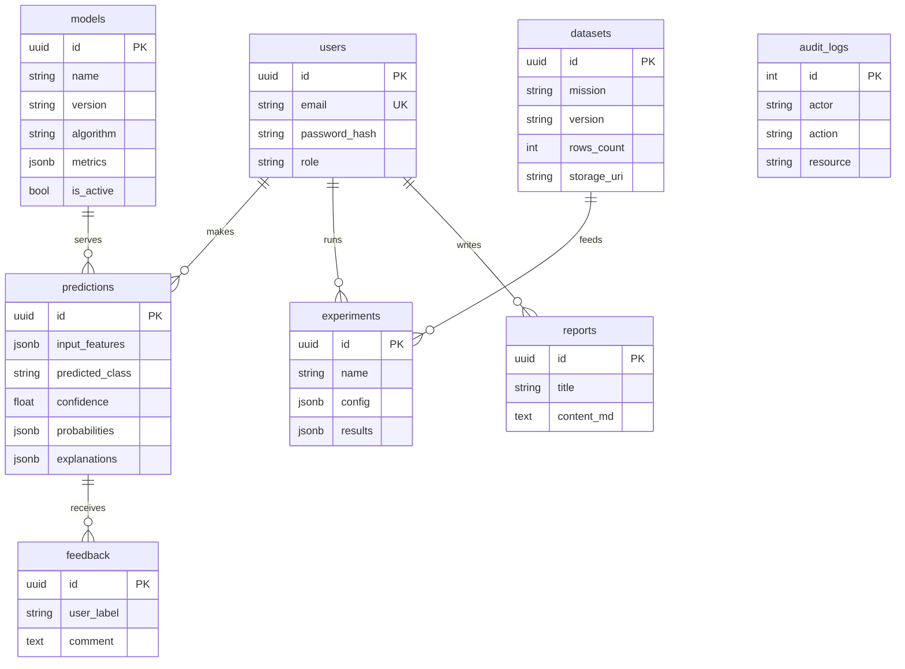

# AstroSynth ER Diagram

```mermaid
erDiagram
  users ||--o{ predictions : makes
  users ||--o{ experiments : runs
  users ||--o{ reports : writes
  models ||--o{ predictions : serves
  predictions ||--o{ feedback : receives
  datasets ||--o{ experiments : feeds

  users {
    uuid id PK
    string email UK
    string password_hash
    string role
  }
  datasets {
    uuid id PK
    string mission
    string version
    int rows_count
    string storage_uri
  }
  models {
    uuid id PK
    string name
    string version
    string algorithm
    jsonb metrics
    bool is_active
  }
  predictions {
    uuid id PK
    jsonb input_features
    string predicted_class
    float confidence
    jsonb probabilities
    jsonb explanations
  }
  experiments {
    uuid id PK
    string name
    jsonb config
    jsonb results
  }
  reports { uuid id PK string title text content_md }
  feedback { uuid id PK string user_label text comment }
  audit_logs { int id PK string actor string action string resource }
```
