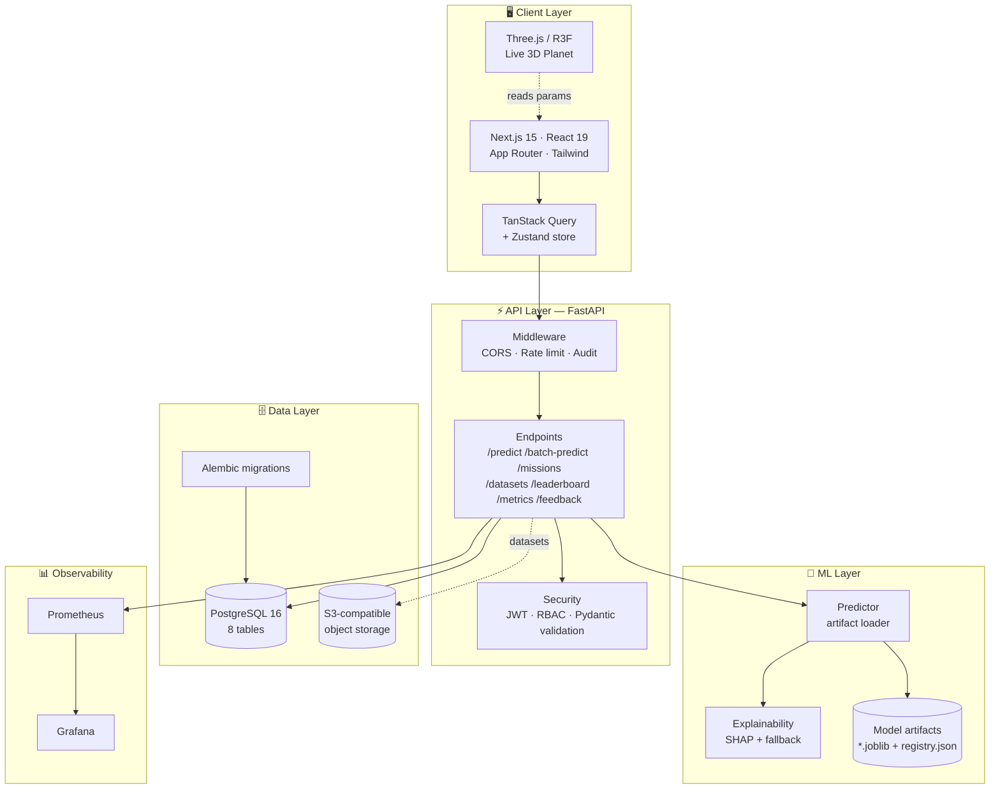
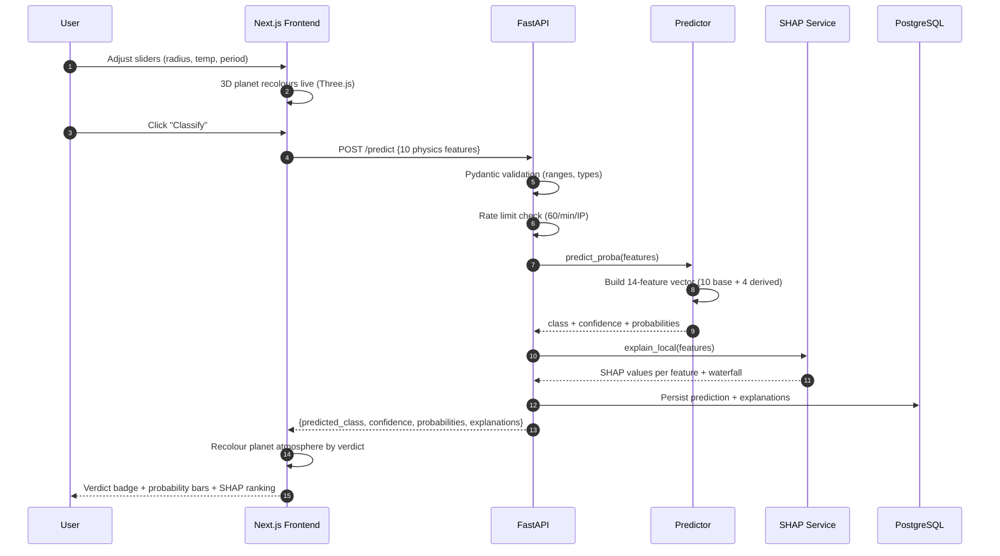
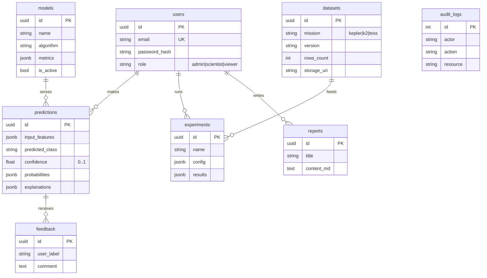
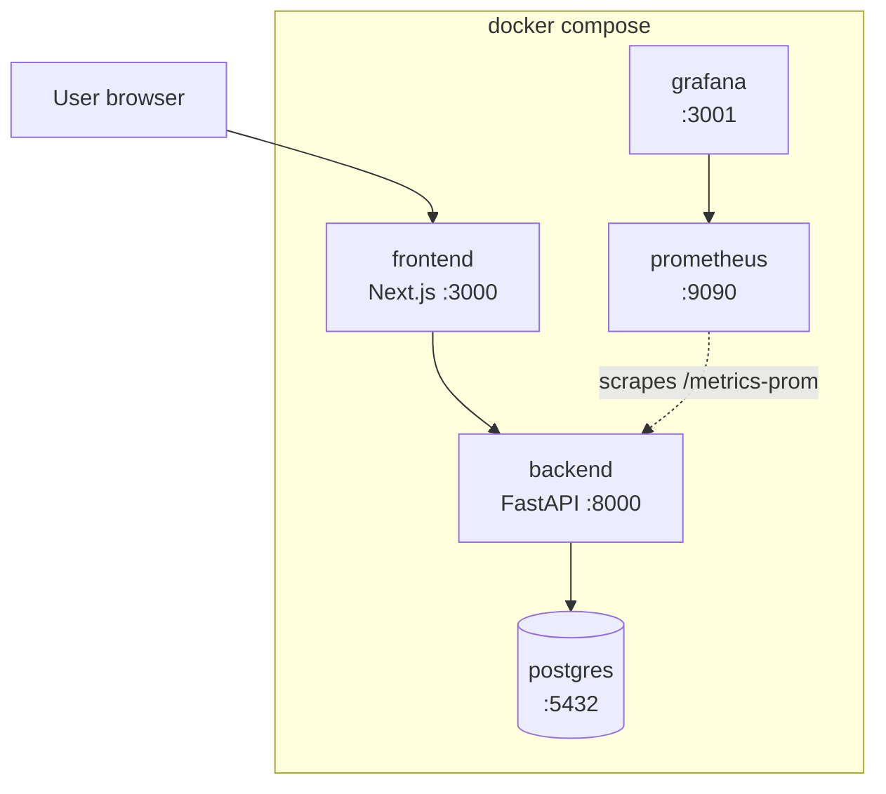

# AstroSynth Architecture

## System overview

## Request flow — `POST /api/v1/predict`

## Machine learning pipeline

```mermaid
graph LR
    A["1 · Ingestion<br/>NASA Exoplanet Archive<br/>Kepler / K2 / TESS"] --> B["2 · Validation<br/>range checks<br/>schema"]
    B --> C["3 · Cleaning<br/>median imputation<br/>bound clipping"]
    C --> D["4 · Feature engineering<br/>10 base + 4 derived<br/>physics features"]
    D --> E["5 · Train/test split<br/>stratified 80/20"]
    E --> F["6 · Hyperparameter opt<br/>Optuna · 30 trials"]
    F --> G["7 · Training<br/>RF · XGBoost<br/>LightGBM · CatBoost"]
    G --> H["8 · Evaluation<br/>acc · prec · rec<br/>F1 · ROC-AUC"]
    H --> I["9 · Explainability<br/>SHAP global + local"]
    I --> J["10 · Registry<br/>artifacts + metrics<br/>versioned"]
    J --> K["Deployment<br/>FastAPI serves artifact"]
```

## Feature engineering — 10 base + 4 derived

| # | Feature | Unit | Physical meaning |
|---|---|---|---|
| 1 | `orbital_period` | days | Time for one orbit |
| 2 | `transit_duration` | hours | How long the planet blocks the star |
| 3 | `planet_radius` | R⊕ | Planet size |
| 4 | `stellar_radius` | R☉ | Host star size |
| 5 | `stellar_mass` | M☉ | Host star mass |
| 6 | `stellar_temp` | K | Stellar effective temperature |
| 7 | `transit_depth` | ppm | Fractional dimming |
| 8 | `snr` | — | Signal-to-noise ratio |
| 9 | `semi_major_axis` | AU | Orbital distance |
| 10 | `equilibrium_temp` | K | Planet temperature |

| Derived | Formula | What it captures |
|---|---|---|
| `snr_per_depth` | `snr / (depth + 1)` | Signal quality per unit dimming |
| `log_period` | `log1p(period)` | Compresses wide period range |
| `radius_ratio` | `R_p / (R★ × 109.2)` | True planet-to-star size ratio |
| `temp_ratio` | `T_eq / T★` | Insolation balance |

## Database schema

## Deployment topology

Postgres is optional at runtime. Without it the API still answers predictions; it logs the
skipped write once and keeps going.

## Technology decisions

| Choice | Why | Cost |
|---|---|---|
| **FastAPI** | Pydantic v2 validation and auto-generated OpenAPI docs | Python-only ecosystem |
| **Artifact-based serving** | Model never trains on request, so a prediction is reproducible | A model swap needs a restart |
| **SHAP with a labelled fallback** | Explanations are always present, and the response says which method produced them | Fallback values are approximate, not true Shapley values |
| **Procedural planet textures** | No external assets, so the 3D view works offline | Less photorealistic than a mapped texture |
| **14-feature parity train to serve** | The same derivation lives in `ml/src/features.py` and `backend/app/services/predictor.py`; `test_predict_includes_explanations_for_every_feature` fails if they drift | Two copies to keep in sync |
| **PostgreSQL + Alembic** | The schema is reviewable as SQL and managed as a migration | A migration step before first run |
| **Prometheus/Grafana** | Operational visibility, not only ML metrics | Another two containers to run |

## Scaling path

| Today | At scale |
|---|---|
| In-memory rate limiter | Redis sliding window |
| Local `.joblib` artifacts | S3 plus MLflow Model Registry |
| Trained on a downloaded CSV snapshot | Live TAP queries with a caching layer |
| Synchronous batch predict | A job queue with polling |
| Single Postgres | Read replicas, and partition `predictions` by month |
| Startup fallback model | Fail fast when no artifact is present |
